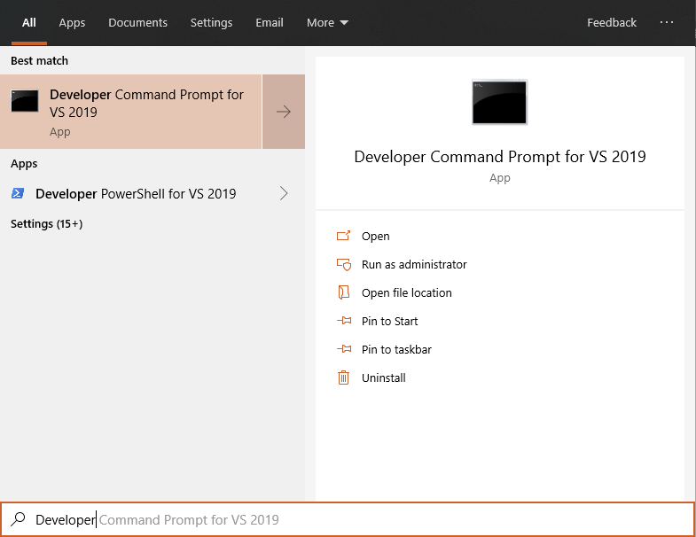

# Ludo en C++

Trabajo final de fin de curso de Programación I de la carrera de Ingeniería de Software de la UPC.

## Objetivos del trabajo 🚀

- **ABET – EAC - Student Outcome 1**: La capacidad de identificar, formular y resolver problemas complejos de ingeniería mediante la aplicación de los principios de la ingeniería, la ciencia y las matemáticas.
- **ABET – CAC - Student Outcome 1**: Analizar un problema de computación complejo y aplicar principios de computación y otras disciplinas relevantes para identificar soluciones.

## Pre-Requisitos 📋

Hay dos opciones para compilar este proyecto:

1. [_Microsoft Visual C++ 2019 - Standalone Build Tools_](https://aka.ms/buildtools)
2. [_Microsoft Visual C++ 2019 - Community/Professional/Enterprise_](https://visualstudio.microsoft.com/)

El proyecto está 100% probado que funciona utilizando los _Build Tools_ de forma independiente del editor _Visual Studio_, pero debería funcionar de todas maneras con el último.

**Importante**: Es necesario tener instalado en cualquiera de los dos casos el soporte para código de _C++/CLI_.

## Compilación y Ejecución ⚙️

Se pueden utilizar los archivos binarios precompilados, disponibles en GitHub como [_releases_](https://github.com/dalbitresb12/ludo-cpp/releases).

Para compilar el proyecto, se puede usar [**_Makefile.bat_**](Makefile.bat), este se encargará de buscar las herramientas de compilación de Visual Studio 2019 y realizará las verificaciones necesarias a los archivos del proyecto para iniciar la compilación.

El resultado de la compilación siempre estará dentro de la carpeta ```build/```.

### Compilar utilizando la línea de comandos 🖥️

Los siguientes comandos deberían compilar el proyecto y guardarlo en la carpeta ```build/```. Esto siempre y cuando se ejecute desde una terminal con las herramientas de Visual Studio incluidas:

```batch
cd C:\ruta\del\proyecto\
mkdir build && mkdir build\obj
cl.exe /clr /Fe: C:\ruta\del\proyecto\build\main.exe /Fo: C:\ruta\del\proyecto\build\obj\ /I C:\ruta\del\proyecto\includes\ C:\ruta\del\proyecto\main.cpp
```

Para abrir una terminal con las herramientas de Visual Studio ya incluidas, se puede usar los atajos del menú inicio que se crean al instalar Visual Studio (_Standalone Build Tools_ o _Community/Professional/Enterprise_). Se pueden encontrar buscando "_Developer_" el menú de Windows:



### Ajustes del compilador ⚙️

- C++/CLI (```/clr```)
- Name EXE File (```/Fe: ${workspaceFolder}/build/${fileBasenameNoExtension}.exe```)
- Object File Name (```/Fo: ${workspaceFolder}/build/obj/```)
- Include Paths (```/I ${workspaceFolder}/includes/```)
- File Path (```${workspaceFolder}/main.cpp```)

## Archivos necesarios para la ejecución 🛠️

### **Archivo principal:**

- [**_main.cpp_**](main.cpp): Contiene la lógica inicial del programa.

### **Archivos de cabecera:**

- [**_includes/menu.h_**](includes/menu.h): Contiene la lógica para los diferentes menúes del programa.
- [**_includes/game.h_**](includes/game.h): Contiene la lógica para el juego.
- [**_includes/utils.h_**](includes/utils.h): Contiene funciones utilizadas en diversas ocasiones en todo el programa.
- [**_includes/dice.h_**](includes/dice.h): Contiene las cadenas de texto necesarias para imprimir las 6 versiones del dado.
- [**_includes/movements.h_**](includes/movements.h): Contiene los mapas de colores y los mapas de movimiento que las fichas deben seguir.

## Archivos Adicionales 📁

- [**_Makefile.bat_**](Makefile.bat): Inicia la compilación del proyecto después de realizar verificaciones iniciales.
- [**_GetHashes.bat_**](GetHashes.bat): Obtiene los _hashes_ SHA1 de cada archivo esencial del proyecto utilizando la herramienta de Windows _CertUtil_.
- [**_.vscode/c_cpp_properties.json_**](.vscode/c_cpp_properties.json): Contiene la configuración utilizada para la extensión [_C/C++_](https://marketplace.visualstudio.com/items?itemName=ms-vscode.cpptools) de [_Visual Studio Code_](https://code.visualstudio.com/).
- [**_.vscode/tasks.json_**](.vscode/tasks.json): Contiene la configuración de las tareas utilizadas para la compilación del proyecto en [_Visual Studio Code_](https://code.visualstudio.com/).
- [**_.vscode/launch.json_**](.vscode/launch.json): Contiene la configuración de las tareas utilizadas para el _debug_ del proyecto en [_Visual Studio Code_](https://code.visualstudio.com/).

## Documentación de apoyo 📚

- [Microsoft C++, C, and Assembler documentation](https://docs.microsoft.com/en-us/cpp/?view=vs-2019)
- [Microsoft Windows Console Documentation](https://docs.microsoft.com/en-us/windows/console/)
- [C++ Reference](https://www.cplusplus.com/reference/)

## Autores ✒️

- Diego Albitres Blondet - ([GitHub](https://github.com/dalbitresb12))
- Ángel Omar Meneses Torres - ([GitHub](https://github.com/amenes12))

## Licencia 📄

Este proyecto está bajo la Licencia **GNU General Public License v3.0** - mira el archivo [LICENSE](LICENSE) para más detalles.
